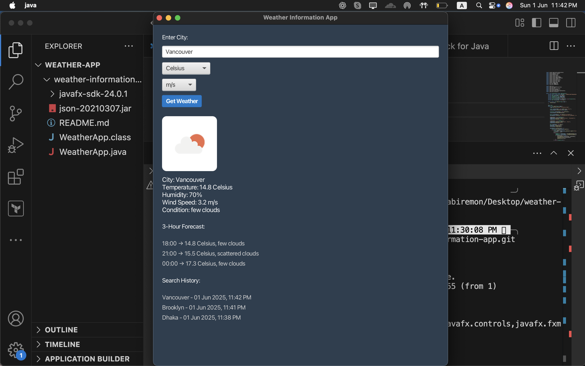

# 🌦️ Weather Information App (JavaFX)

This is a **JavaFX-based desktop weather application** that provides real-time weather updates and short-term forecasts for any city using the [OpenWeatherMap API](https://openweathermap.org/api).

---

## Features

✅ Real-time current weather  
✅ 3-hour forecast preview (next 3 time slots)  
✅ Unit conversion (Celsius/Fahrenheit, m/s or km/h)  
✅ Search history with timestamps  
✅ Clean, dark-themed GUI built with JavaFX  
✅ Weather icons with visibility enhancements  
✅ Error handling for invalid inputs or network issues

---

## Screenshots

Here’s a full preview of the app showing:

- ✅ Real-time weather data
- 🌤️ 3-hour forecast section
- 🕓 Search history with timestamps
- 🎨 Dark-themed UI with weather icon and formatting



---

## 🚀 How to Run the App

### 1. Clone the Repository

```bash
git clone https://github.com/neamulkabiremon/weather-information-app.git
cd weather-information-app
```
## 2. Download JavaFX SDK
- Download JavaFX SDK (matching your OS/architecture) from https://gluonhq.com/products/javafx/

- Extract it and place it in the project directory (e.g., javafx-sdk-24.0.1)

## 3. Compile

```bash
javac --module-path javafx-sdk-24.0.1/lib --add-modules javafx.controls,javafx.fxml -cp json-20210307.jar WeatherApp.java
```

## 4. Run
```bash
java --module-path javafx-sdk-24.0.1/lib --add-modules javafx.controls,javafx.fxml -cp .:json-20210307.jar WeatherApp
```
💡 On Windows, replace : with ; in the classpath

## 🔑 API Key Setup
This app uses the OpenWeatherMap API. You can use the included API key or sign up: https://openweathermap.org/api to get your own.

The API key is embedded inside WeatherApp.java:
```bash
private static final String API_KEY = "your_api_key_here";
```
Replace it with your key if needed.

## Technologies Used
- Java 17
- JavaFX SDK 21–24
- OpenWeatherMap API
- org.json (for JSON parsing)

Author
Neamul Kabir Emon
🔗 LinkedIn : https://www.linkedin.com/in/neamul-kabir-emon 
